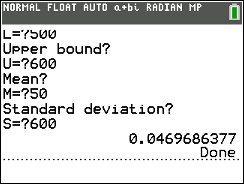

# Python Basic
*An easier way to write TI-Basic!*

**Python Basic aims to simplify the process of writing code for Texas Instruments calculators.**

<a href="https://www.buymeacoffee.com/roniemartinez" target="_blank"></a>

For example, consider this code written in TI-Basic:
```
Prompt A
Prompt B
A²+B²→C
Disp √(C)
```

If you wanted to write the same thing in Python Basic, it would be the following:
```python
import pythonbasic as pb
import math

def theorum():
    pb.Prompt(A)
    pb.Prompt(B)
    C = pb.power(A, 2) + pb.power(B, 2)
    pb.disp(math.sqrt(C))

pb.setup(globals(), __file__, theorum)
```

This may not seem like much of an advantage, until you consider the often confusing syntax of TI-Basic.
TI-Basic:
* Doesn't color code anything
* Doesn't intent any lines
* Can often use confusing syntax

That's what *Python Basic* is for! Python Basic is written in a standard code editor, such as Visual Studio Code. Because you're in a standard text editor, you can more easily write and understand your code, and the module will convert everything to TI-Basic and output a text file. From there, you copy and paste the TI-Basic into the [TI Connect](https://education.ti.com/en/products/computer-software/ti-connect-sw) or [TI Connect CE](https://education.ti.com/en/products/computer-software/ti-connect-ce-sw) app and send it to your calculator.

## Here's a more complex example
Let's say you want a TI-Basic program that has a main menu. From there, the user can select one of five options: add, subtract, multiply, divide, or quit. If the user selects quit, the program ends. If they select any of the other options, it will prompt the user for two numbers and then perform that operation on them, returning the result.

### Here's what that looks like in *Python Basic*:
```python
import pythonbasic as pb

def main_menu_function(option):
    if option == "Add":
        pb.Prompt(A)
        pb.Prompt(B)
        S = A + B
        pb.disp(S)
        pb.pause()
        pb.clrHome()
        pb.goToMenu(main_menu)
    if option == "Subtract":
        pb.Prompt(A)
        pb.Prompt(B)
        pb.disp(A - B)
        pb.pause()
        pb.clrHome()
        pb.goToMenu(main_menu)
    if option == "Multiply":
        pb.Prompt(A)
        pb.Prompt(B)
        pb.disp(A * B)
        pb.pause()
        pb.clrHome()
        pb.goToMenu(main_menu)
    if option == "Divide":
        pb.Prompt(A)
        pb.Prompt(B)
        pb.disp(A / B)
        pb.pause()
        pb.clrHome()
        pb.goToMenu(main_menu)
    if option == "Quit":
        pb.Stop()

main_menu = pb.Menu("Main Menu", main_menu_function, [pb.MenuOption("Add"), pb.MenuOption("Subtract"), pb.MenuOption("Multiply"), pb.MenuOption("Divide"), pb.MenuOption("Quit")])

pb.setup(globals(), __file__)
```

### And here's the translated code in TI-Basic:
```
Lbl AG
Menu("MAIN MENU","ADD",AB,"SUBTRACT",AC,"MULTIPLY",AD,"DIVIDE",AE,"QUIT",AF
Lbl AB
Prompt A
Prompt B
A+B→S
Disp S
Pause 
ClrHome
Goto AG
Stop
Lbl AC
Prompt A
Prompt B
Disp A-B
Pause 
ClrHome
Goto AG
Stop
Lbl AD
Prompt A
Prompt B
Disp A*B
Pause 
ClrHome
Goto AG
Stop
Lbl AE
Prompt A
Prompt B
Disp A/B
Pause 
ClrHome
Goto AG
Stop
Lbl AF
Stop
Stop
```

**Which looks easier to read and understand?** Definitely not the latter.

This is the point of Python Basic: *to make this often confusing language much, much more accessible.*

## One final example
This one's for the fellow nerds who took a statistics class in school.

Say you want to find the probability of getting a number within a certain interval. If your distribution of numbers is normal, you can use normalcdf to find this probability. And yes, *Python Basic* supports normalcdf, too.

### In *Python Basic*:
```python
import pythonbasic as pb

def normal_probability():
    pb.clrHome()
    pb.disp("Lower bound?")
    pb.Prompt(L)
    pb.disp("Upper bound?")
    pb.Prompt(U)
    pb.disp("Mean?")
    pb.Prompt(M)
    pb.disp("Standard deviation?")
    pb.Prompt(S)
    P = pb.normalcdf(L, U, M, S)
    pb.disp(P)

pb.setup(globals(), __file__, normal_probability)
```

### Translation in TI-Basic:
```
ClrHome
Disp "Lower bound?"
Prompt L
Disp "Upper bound?"
Prompt U
Disp "Mean?"
Prompt M
Disp "Standard deviation?"
Prompt S
normalcdf(L,U,M,S)→P
Disp P
```
| 
|:--:| 
| *The translated code running on a TI-84 Plus CE* |
